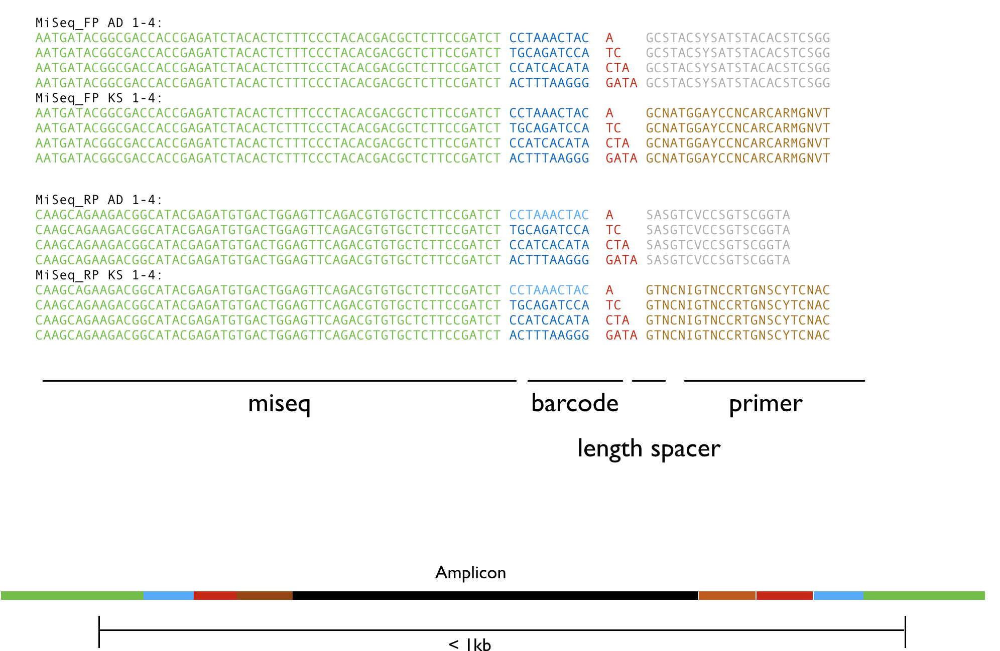

## Tools for Working with Barcoded Amplicons.

This package is for demultiplexing paired end Illumina reads where barcodes have been incorporated as the 
first bases of the Forward and Reverse read according to the following scheme:

### Current Commands

The following are the current list of commands. At this point we do not guarantee this will stay around. We are in the process
of pruning unused commands that are not essential.

- demultiplexfasta
- fastqconcat
- demultiplexfasta
- demultiplexfasta_parallel
